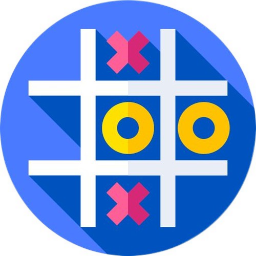

<!-- Improved compatibility of back to top link: See: https://github.com/othneildrew/Best-README-Template/pull/73 -->

<a id="readme-top"></a>

<!--
*** Thanks for checking out the Best-README-Template. If you have a suggestion
*** that would make this better, please fork the repo and create a pull request
*** or simply open an issue with the tag "enhancement".
*** Don't forget to give the project a star!
*** Thanks again! Now go create something AMAZING! :D
-->

<!-- PROJECT SHIELDS -->
<!--
*** I'm using markdown "reference style" links for readability.
*** Reference links are enclosed in brackets [ ] instead of parentheses ( ).
*** See the bottom of this document for the declaration of the reference variables
*** for contributors-url, forks-url, etc. This is an optional, concise syntax you may use.
*** https://www.markdownguide.org/basic-syntax/#reference-style-links
-->

[![Contributors][contributors-shield]][contributors-url]
[![Forks][forks-shield]][forks-url]
[![Stargazers][stars-shield]][stars-url]
[![Issues][issues-shield]][issues-url]
[![project_license][license-shield]][license-url]
[![LinkedIn][linkedin-shield]][linkedin-url]

<!-- PROJECT LOGO -->
<br />
<div align="center">
  <a href="https://github.com/ayemteezy/tic">
    
  </a>

<h3 align="center">Odin Tic Tac Toe</h3>

  <p align="center">
    A browser-based Tic Tac Toe game built as part of The Odin Project curriculum (Full Stack JavaScript path). The focus of this project is organizing JavaScript using factory functions and the module pattern, keeping game logic decoupled from the DOM.
    <br />
    <a href="https://github.com/ayemteezy/tic-tac-toe"><strong>Explore the docs »</strong></a>
    <br />
    <br />
    <a href="https://github.com/ayemteezy/tic-tac-toe">View Demo</a>
    &middot;
    <a href="https://github.com/ayemteezy/tic-tac-toe/issues/new?labels=bug&template=bug-report.md">Report Bug</a>
    &middot;
    <a href="https://github.com/ayemteezy/tic-tac-toe/issues/new?labels=enhancement&template=feature-request.md">Request Feature</a>
  </p>
</div>

<!-- TABLE OF CONTENTS -->
<details>
  <summary>Table of Contents</summary>
  <ol>
    <li>
      <a href="#about-the-project">About The Project</a>
      <ul>
        <li><a href="#built-with">Built With</a></li>
      </ul>
    </li>
    <li>
      <a href="#getting-started">Getting Started</a>
      <ul>
        <li><a href="#prerequisites">Prerequisites</a></li>
        <li><a href="#installation">Installation</a></li>
      </ul>
    </li>
    <li><a href="#usage">Usage</a></li>
    <li><a href="#roadmap">Roadmap</a></li>
    <li><a href="#contributing">Contributing</a></li>
    <li><a href="#license">License</a></li>
    <li><a href="#contact">Contact</a></li>
    <li><a href="#acknowledgments">Acknowledgments</a></li>
  </ol>
</details>

<!-- ABOUT THE PROJECT -->

## About The Project

[![Tic Tac Toe Screen Shot][product-screenshot]](https://example.com)
 
This project is part of [The Odin Project](https://www.theodinproject.com/lessons/node-path-javascript-tic-tac-toe)'s JavaScript course. The goal was to build a two-player Tic Tac Toe game while keeping as much logic as possible out of the global scope, using **factory functions** for players and the **module pattern** for the gameboard and game controller.
 
The application features:

- An interactive 3x3 board that updates on every click
- Win and tie detection across all 8 possible winning combinations
- A persistent scoreboard tracking wins for each player and total draws across rounds
- A custom animated ribbon-style result banner announcing the winner or a tie

This project emphasizes DOM manipulation, event handling, separating game state from rendering logic, and modern JavaScript practices including `FormData` for reading form input and CSS `clip-path` for custom shapes.

<p align="right">(<a href="#readme-top">back to top</a>)</p>

### Built With

- [![HTML5][HTML5]][HTML5-url]
- [![CSS3][CSS3]][CSS3-url]
- [![JavaScript][JavaScript]][JavaScript-url]

<p align="right">(<a href="#readme-top">back to top</a>)</p>

<!-- GETTING STARTED -->

## Getting Started

To get a local copy up and running, follow these steps.

### Prerequisites

No build tools or package managers are required. Just a modern web browser.

### Installation

1. Clone the repo

```sh
git clone https://github.com/ayemteezy/tic-tac-toe.git
```

2. Open `index.html` in your browser

Or simply drag and drop the file into your browser window.

<p align="right">(<a href="#readme-top">back to top</a>)</p>

<!-- USAGE EXAMPLES -->

## Usage

1. Click the "Start Game" button to open the player setup modal
2. Enter names for Player 1 (X) and Player 2 (O)
3. Click "Play" to begin the round
4. Click any empty tile on the board to place your mark — players alternate turns automatically
5. When a player gets three in a row (horizontally, vertically, or diagonally), or the board fills up with no winner, the result banner announces the outcome and the scoreboard updates
6. Click "Start Game" again to play another round — scores carry over between rounds


<p align="right">(<a href="#readme-top">back to top</a>)</p>

<!-- ROADMAP -->

## Roadmap

- [x] Two-player setup modal with name input
- [x] Core game logic (turns, win detection, tie detection)
- [x] Scoreboard tracking wins and draws
- [x] Custom result banner with ribbon styling
- [x] Reset scoreboard button
- [ ] Single-player mode vs. computer (minimax AI)

See the [open issues](https://github.com/ayemteezy/tic-tac-toe/issues) for a full list of proposed features (and known issues).

<p align="right">(<a href="#readme-top">back to top</a>)</p>

<!-- CONTRIBUTING -->

## Contributing

Contributions are what make the open source community such an amazing place to learn, inspire, and create. Any contributions you make are **greatly appreciated**.

If you have a suggestion that would make this better, please fork the repo and create a pull request. You can also simply open an issue with the tag "enhancement".
Don't forget to give the project a star! Thanks again!

1. Fork the Project
2. Create your Feature Branch (`git checkout -b feature/AmazingFeature`)
3. Commit your Changes (`git commit -m 'Add some AmazingFeature'`)
4. Push to the Branch (`git push origin feature/AmazingFeature`)
5. Open a Pull Request

<p align="right">(<a href="#readme-top">back to top</a>)</p>

### Top contributors:

<a href="https://github.com/ayemteezy/tic-tac-toe/graphs/contributors">
  
</a>


<!-- LICENSE -->

## License

Distributed under the MIT License. See `LICENSE.txt` for more information.

<p align="right">(<a href="#readme-top">back to top</a>)</p>

<!-- CONTACT -->

## Contact

- Twitter/X: [@ayemteezy\_](https://x.com/ayemteezy_)
- Email: [laurencelestercarino@gmail.com](mailto:laurencelestercarino@gmail.com)
- GitHub: [ayemteezy](https://github.com/ayemteezy)

Project Link: [https://github.com/ayemteezy/tic-tac-toe](https://github.com/ayemteezy/tic-tac-toe)

<p align="right">(<a href="#readme-top">back to top</a>)</p>

<!-- ACKNOWLEDGMENTS -->

## Acknowledgments

- [The Odin Project](https://www.theodinproject.com/) — for the project brief and curriculum
- [Modern Normalize](https://github.com/sindresorhus/modern-normalize) — for the CSS normalization
- [Google Fonts](https://fonts.google.com/) — `Cherry Bomb One` and `Poppins`
- [contrib.rocks](https://contrib.rocks) — contributor image generator


<p align="right">(<a href="#readme-top">back to top</a>)</p>

<!-- MARKDOWN LINKS & IMAGES -->
<!-- https://www.markdownguide.org/basic-syntax/#reference-style-links -->

[contributors-shield]: https://img.shields.io/github/contributors/ayemteezy/tic-tac-toe.svg?style=for-the-badge
[contributors-url]: https://github.com/ayemteezy/tic-tac-toe/graphs/contributors
[forks-shield]: https://img.shields.io/github/forks/ayemteezy/tic-tac-toe.svg?style=for-the-badge
[forks-url]: https://github.com/ayemteezy/tic-tac-toe/network/members
[stars-shield]: https://img.shields.io/github/stars/ayemteezy/tic-tac-toe.svg?style=for-the-badge
[stars-url]: https://github.com/ayemteezy/tic-tac-toe/stargazers
[issues-shield]: https://img.shields.io/github/issues/ayemteezy/tic-tac-toe.svg?style=for-the-badge
[issues-url]: https://github.com/ayemteezy/tic-tac-toe/issues
[license-shield]: https://img.shields.io/github/license/ayemteezy/tic-tac-toe.svg?style=for-the-badge
[license-url]: https://github.com/ayemteezy/tic-tac-toe/blob/main/LICENSE.txt
[linkedin-shield]: https://img.shields.io/badge/-LinkedIn-black.svg?style=for-the-badge&logo=linkedin&colorB=555
[linkedin-url]: https://www.linkedin.com/in/laurence-lester-cari%C3%B1o/
[product-screenshot]: assets/images/screenshot.png

<!-- Shields.io badges. You can a comprehensive list with many more badges at: https://github.com/inttter/md-badges -->

[HTML5]: https://img.shields.io/badge/HTML5-E34F26?style=for-the-badge&logo=html5&logoColor=white
[HTML5-url]: https://developer.mozilla.org/en-US/docs/Web/HTML
[CSS3]: https://img.shields.io/badge/css3-%23663399?style=for-the-badge&logo=css&logoColor=white
[CSS3-url]: https://developer.mozilla.org/en-US/docs/Web/CSS
[JavaScript]: https://img.shields.io/badge/javascript-%23F7DF1E?style=for-the-badge&logo=javascript&logoColor=black
[JavaScript-url]: https://developer.mozilla.org/en-US/docs/Web/JavaScript
